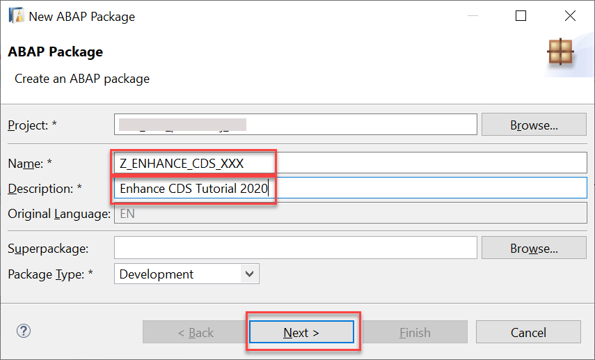

#                     Title Title from the Tutorial body upd
<!-- description -->         Description from the Tutorial body

## You will learn  
Now that you have set up a Dqqqqestination in the HANA Cloud Platform (HCP) cockpit, # you will connect that destination to your local application.  

## Prerequisites  

 - **Proficiency:** Beginner 
 - **Web IDE** If you do not have the Web IDE open, follow these steps: <!-- test --> [# Enable and open the HANA Cloud Platform Web IDE](https://go.sap.com/developer/tutorials/sapui5-webide-open-webide.html)
 - **Tutorials:** This tutorial is part of a series. ### The previous tutorial is [Set up the Northwind Destination](https://go.sap.com/developer/tutorials#/hcp-create-destination.html)


## Intro

Virtual tables point to data stored in another database.  Federated queries join local and virtual tables.  


### Create package

1. Create a new package for this tutorial, # by choosing **New > ABAP Package**.
Name your package (my_package#####)

    <!-- border --> 

2. Enter a name **`Package Z_ENHANCE_CDS_XXX`** and description **Enhance CDS Tutorial 2020**, then follow the wizard.

    <!-- border; size:250px --> 

    <!-- border --> 
    
3. Replace strings (these commands have been adapted from the standard [Luigi React example](https://github.com/SAP/luigi/blob/master/scripts/setup/react.sh).) Note that you may get a warning such as `event not found`, but this can safely be ignored. Copy and paste the following:

    ```Shell [2,5,7,10,12]
    sed "s/const HtmlWebpackPlugin = require('html-webpack-plugin');/const HtmlWebpackPlugin = require('html-webpack-plugin');const CopyWebpackPlugin = require('copy-webpack-plugin');/g" config/webpack.config.js > config/webpack.config.tmp.js && mv config/webpack.config.tmp.js config/webpack.config.js

    sed "s/new HtmlWebpackPlugin(/new CopyWebpackPlugin([\
    {context: ### 'public', to: 'index.html', from: 'index.html'  },\
    {context: 'node_modules\/@luigi-project\/core',to: '.\/luigi-core',from: {glob: '**',dot: true}}],\
    {ignore: ['.gitkeep', '**\/.DS_Store', '**\/Thumbs.db'],debug: 'warning'\
    }),\
    new HtmlWebpackPlugin(/g" config/webpack.config.js > config/webpack.config.tmp.js && mv config/webpack.config.tmp.js config/webpack.config.js

    sed "s/template: paths.appHtml,/template: paths.appHtml,\
    filename: 'sampleapp.html',/g" config/webpack.config.js > config/webpack.config.tmp.js && mv config/webpack.config.tmp.js config/webpack.config.js

    sed "s/public\/index.html/public\/sampleapp.html/g" config/paths.js > config/paths.tmp.js && mv config/paths.tmp.js config/paths.js

    sed "s/publicUrl + '\/index.html',/publicUrl + '\/sampleapp.html',/g" config/webpack.config.js > config/webpack.config.tmp.js && mv config/webpack.config.tmp.js config/webpack.config.js

    sed "s/const isWsl = require('is-wsl');//g" config/webpack.config.js > config/webpack.config.tmp.js && mv config/webpack.config.tmp.js config/webpack.config.js

    #This can throw a warning, it can be ignored
    sed "s/!isWsl/true/g" config/webpack.config.js > config/webpack.config.tmp.js && mv config/webpack.config.tmp.js config/webpack.config.js

    echo "const path = require('path');
    module.exports = {
        entry: './src/luigi-config/luigi-config.es6.js',
        output: {
            filename: 'luigi-config.js',
            path: path.resolve(__dirname, 'public'),
        },
    };">webpack.config.js

    sed 's/"scripts": {/"scripts": {\
    \    "buildConfig":#####"webpack --config webpack.config.js",/1' package.json > p.tmp.json && mv p.tmp.json package.json

    echo ### '{
        "globals": {
            "Luigi": "readonly"
        }
    }'>.eslintrc.json
    ```

[DONE]

### Build a Single Page Application Using UI5 Web Components for React 
   
### Single-choice 
 
### Multi-choice 

### Long question 

### One letter in the question

### One digit in the question

### New step for test 1
Test

### New step for test 2
Test Test
 


